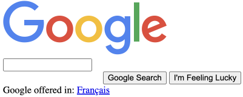
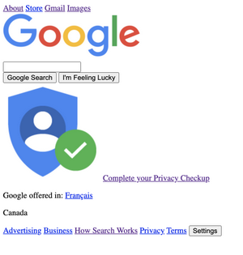

# Leading a week-long front-end bootcamp

[Notion Slides](\* https://www.notion.so/bb7f3b16bae7427194cc5c4fc43416a0?v=f5e30f0e05d94b29bc5f8061a0f92f83)

From Aug 3, 2021 to Aug 6, 2021, I lead a 4 day, 2-hours a day zoom frontend bootcamp for the non profit: [CICS](https://www.cicscanada.com/en/).

## Goal of the bootcamp

-   building [google.ca](https://google.ca)
-   brief overview of some HTML, CSS, JS
-   how websites work

Inspiration

-   https://developer.mozilla.org/en-US/docs/Learn

## Timeline

### HTML

-   Learn some HTML tags
-   Demo: TinyMCE and the browser dev tools
    -   https://www.tiny.cloud/docs/demo/basic-example/
-   Going through a simplified Google.ca
    -   [final code sandbox](https://codesandbox.io/s/google-html-final-rsnzv?file=/index.html)
    -   

### Uploading to GitHub pages

-   Beyond the scope to teach Git
-   I'm using the GitHub.com GUI

### CSS

-   update the GitHub content
-

### JS

-   Dynamic
-   cornify.com
-   Google.ca: menu
    -   update GitHub
-   Overview of how JS is used outside of the frameworks

### How the web works

-   DNS
    -   IP Address
-   HTTPS

### Next steps

-   FreeCodeCamp
-

## Though process

I tried to give an overview of

I created the content in Notion

Then I created the slides from notion with [this website](https://wunderpresentation.com/create/notion/)

### Why Notion?

I've watched some Thomas Frank videos and he loves it so I'd wanted to try it out.

For my presentation purposes, Markdown might be good enough.

## How

### Why notion slides?

Use this is

## Lessons learned

Narrow my scope

-   only use precisely what we need to know to build google
    -   example: remove `main` tag, `lists`, `headers`
-   I tried to do too much
-   I completely overwhelmed the students

Before, the google site looked like this

Make it more interactive

-   this is tricky
-   some people are on phones or iPads
-   do the FreeCodeCamp exercises together live?

There are things that I glossed over

-   I have the [curse of knowledge](https://en.wikipedia.org/wiki/Curse_of_knowledge)
-   things that I'll add
    -   anatomy of an HTML tag

Empower students to learn more afterward

-   Link to FreeCodeCamp

Change the order

-   post the website on GitHub pages first
-   so that there's more instant feedback

## What I think I did well

-   having the slides available on Notion
