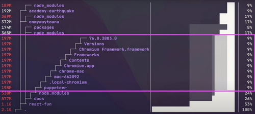
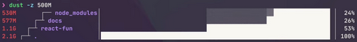
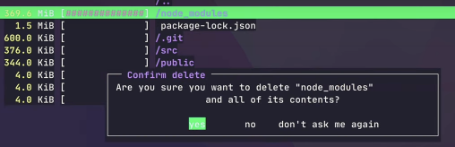

# Disk usage on the terminal

https://fullchee-reminders.netlify.app/link/2092

## `du`

```bash
> du -sh * | sort -hr
601M	backend-core-env
 12M	backendcore
144K	backendcore_scripts
```

-   `du -s`: summary (depth = 0)
-   `-h`: human readable
-   `sort -r`: reverse

## `dust`

```bash
brew install dust
```





## `ncdu`

```bash
brew install ncdu
```

-   interactively walk through the files sorted by size
-   can delete


