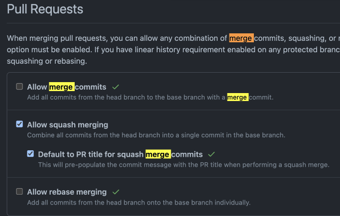

# GitHub Tips and Tricks

## [Refined GitHub](https://github.com/refined-github/refined-github)

https://github.com/refined-github/refined-github

Browser extension that adds a ton of nice features to GitHub

## https://cli.github.com/

## Configuring a repo

### Only allow squash merging



```
https://github.com/"USER"/"REPO_NAME"/settings#merge-button-settings
```

### CODEOWNERS

[About code owners - GitHub Docs](https://docs.github.com/en/repositories/managing-your-repositorys-settings-and-features/customizing-your-repository/about-code-owners)

1. create a file called `CODEOWNERS` in the repo root

```
# the octocats team in the octo-org organization owns all .txt files.
*.txt @octo-org/octocats

docs/ @Fullchee
```


## Git config

???? Move git setup notes

SSH public key

PAT

GitHub and Slack app notifications

### Using multiple SSH keys

[How do I configure git to use multiple SSH keys for different accounts? - Super User](https://superuser.com/questions/1628183/how-do-i-configure-git-to-use-multiple-ssh-keys-for-different-accounts)

On Yianna's computer, when I `git clone <ssh_repo_url>`, I want it to be Yianna's account

So I update `~/.ssh/config`

```
Host github.com
	HostName github.com
	User git
	IdentityFile ~/.ssh/id_rsa

# Fullchee
Host github-fullchee
	HostName github.com
    User git
	IdentityFile ~/.ssh/fullchee_id_rsa
```

If I want to clone a repo from my personal account
- I replace`git@github.com` with `github-fullchee`, the host name

```
git@github.com:Fullchee/private-notes.git
```

```
github-fullchee:Fullchee/private-notes.git
```


```
github-fullchee:Fullchee/private-notes.git
```