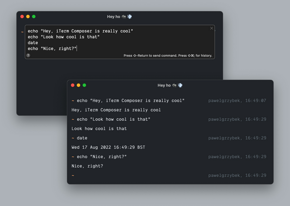
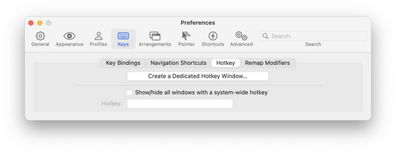

# Mac shell notes

### [View and edit plist files](https://osxdaily.com/2016/03/10/convert-plist-file-xml-binary-mac-os-x-plutil/)

```bash
plutil -convert xml1 ExampleBinary.plist

plutil -convert binary1 Example.plist
```

## M1 Mac notes

### Rosetta

#### iTerm2

1. "iTerm2 -> Preferences -> Profiles -> General"
2. change the "Login Shell" drop down to "Command"
3. enter: `arch -x86_64 /bin/zsh` 4. 
4.  1. Restart iTerm
5. Verify that it worked worked 7. type `arch` into your terminal: you should see `i386`

#### VSCode Terminal: set it up with Rosetta

[Creating a custom VSCode Terminal Profile for using Rosetta on an M1 Mac (Apple Silicon) - DEV Community 👩‍💻👨‍💻](https://dev.to/markwitt_me/creating-a-custom-vscode-terminal-profile-for-using-rosetta-on-an-m1-mac-apple-silicon-2gb2)

#### Docker

-   https://docs.docker.com/desktop/mac/install/
-   don't use `brew`

## iTerm

### [Multi line terminal commands](https://twitter.com/pawelgrzybek/status/1559932351836200960)

1. ⌘ + ⇧ + . to open a Composer
2. Type some cool multi-line command
3. ⇧ + Return to execute



### Hot key

I use `Caps lock E` to toggle the Quake like terminal


