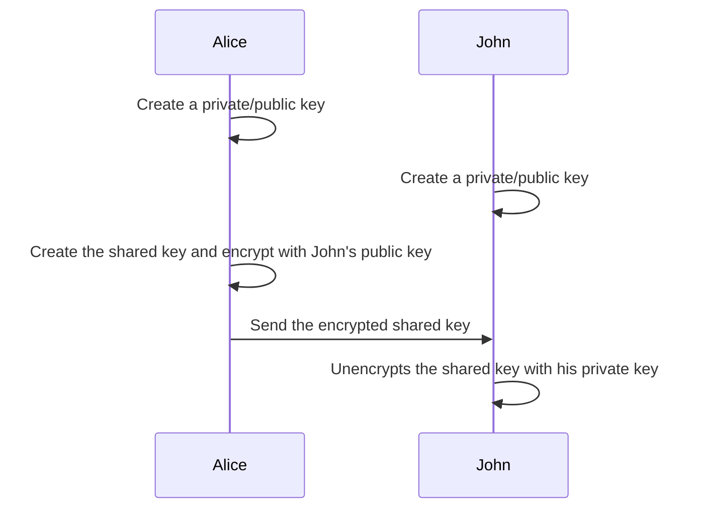

## Asymmetric Encryption

### Creating an SSH key

`ssh-keygen`

Creates 2 files in the `~/.ssh` folder
- `id_rsa`
	- private key
- `id_rsa.pub`
	- public key

### Create a shared key

### Asymmetric Encryption Algos

- RSA

## Symmetric Encryption

Use the same key to encrypt and decrypt

Used to (de)encrypt across the internet

### Symmetric Encryption Algos

- AES
	- AES-256