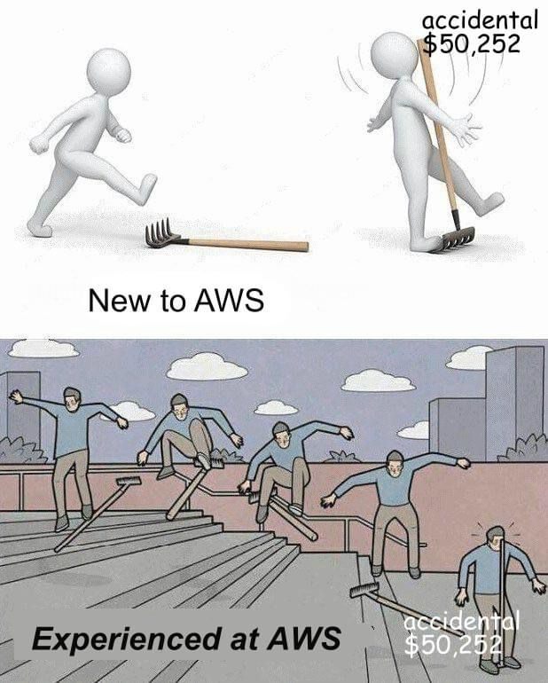

## Setup

-   `aws configure sso`
    -   name your profile `default`
    -   so that you don't need to specify `--profile` every time you use `aws-cli`

## Login

-   `aws sso login --profile "profileName"`
    -   the default profile is `default`
-   Set the `AWS_PROFILE=default` env var

Install SSM

-   https://docs.aws.amazon.com/systems-manager/latest/userguide/session-manager-working-with-install-plugin.html

```bash
aws ssm start-session \
  --target "container-id-ec2, like i-0373fb85e5fbc7d8e" \
  --document-name AWS-StartPortForwardingSession \
  --parameters '{"portNumber":["22"],"localPortNumber":["56789"]}'
```

On Windows

```bash
aws ssm start-session --target "container-id-ec2, like i-0373fb85e5fbc7d8e" --document-name AWS-StartPortForwardingSession --parameters "{\"portNumber\":[\"22\"],\"localPortNumber\":[\"56789\"]}"
```

```bash
ssh -p 56789 root@localhost
```
