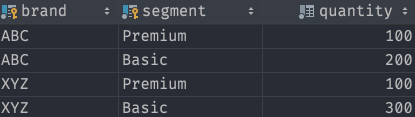
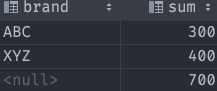
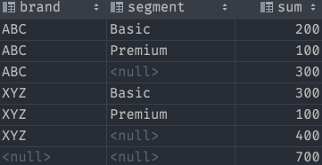

# SQL Window functions

## [ROLLUP](https://www.postgresqltutorial.com/postgresql-rollup/)

-   shorthand for defining multiple grouping sets
-   really great for calculating groups for sums



```sql
SELECT
    brand,
    SUM (quantity)
FROM sales
GROUP BY ROLLUP (brand)
ORDER BY brand;
```



```sql
SELECT
    brand,
    segment,
    SUM (quantity)
FROM sales
GROUP BY ROLLUP (brand, segment)
ORDER BY brand, segment;
```



## Window Functions

See SELECT STAR Julia Evans zine page 14

-   `[expression] OVER ([window definition])`
-   Window is a set of rows

-   The window here is just one row

```sql
SELECT item,
  day - LAG(day) OVER (ORDER BY DAY)
FROM sales
```

-   the window here is each class

```sql
SELECT ROW_NUMBER() OVER(
    PARTITION BY class
    ORDER BY grade DESC
  ) AS rank_in_class
```

PARTITION BY vs GROUP BY

Group by changes the number of rows being returned

PARTITION by is like a group by for one column's calculation
