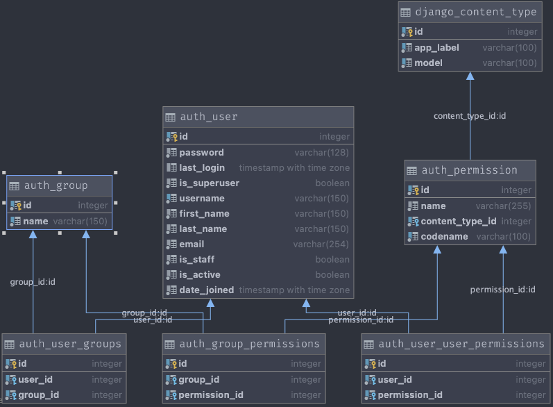

# Django Auth app



## Add a user to a Group

```python
from django.contrib.auth.models import Group
my_group = Group.objects.get(name='my_group_name')

my_group.user_set.add(your_user)
```

## Why it's not enough?

- why we had to implement our own