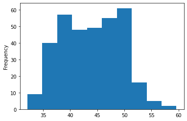
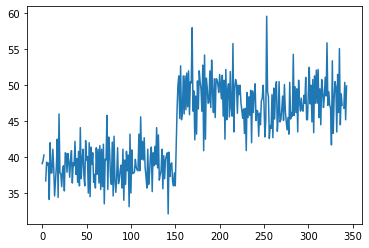
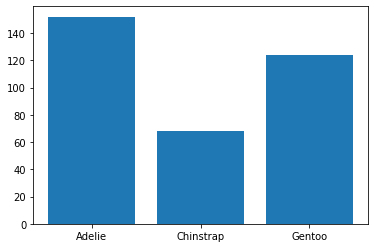
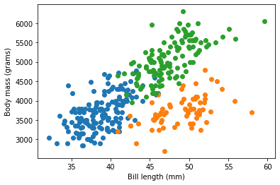
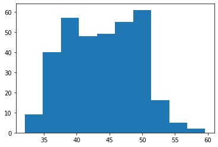

Uses matplotlib

https://pandas.pydata.org/docs/user_guide/visualization.html

```python
import numpy as np
import pandas as pd
import matplotlib.pyplot as plt

plt.close("all")

df = pd.read_csv('penguins.csv')
plt.figure()
df["bill_length_mm"].plot(kind="hist")
plt.show()

plt.figure()
df["bill_length_mm"].plot(kind="line")
plt.show()
```





```python
species_population = df.groupby("species").size()

index = species_population.index
display(list(index))
display(list(species_population.values))

plt.figure()
# x and height must be lists
plt.bar(x = species_population.index, height = species_population.values)
plt.show()
```

    ['Adelie', 'Chinstrap', 'Gentoo']


    [152, 68, 124]



```python
# Scatterplots

species = df.groupby("species")

plt.figure()
plt.xlabel("Bill length (mm)")
plt.ylabel("Body mass (grams)")
for n, grp in species:
    plt.scatter(x = grp['bill_length_mm'], y = grp['body_mass_g'])
plt.show()
```



```python
# correlation between two columns
df.bill_length_mm.corr(df.body_mass_g)

# correlation matrix
df.corr()
```

|                     | bill\_length\_mm | bill\_depth\_mm | flipper\_length\_mm | body\_mass\_g |
|---------------------|------------------|-----------------|---------------------|---------------|
| bill\_len\_mm       | 1.000000         | -0.235053       | 0.656181            | 0.595110      |
| bill\_depth\_mm     | -0.235053        | 1.000000        | -0.583851           | -0.471916     |
| flipper\_length\_mm | 0.656181         | -0.583851       | 1.000000            | 0.871202      |
| body\_mass\_g       | 0.595110         | -0.471916       | 0.871202            | 1.000000      |


```python
plt.figure()
bill_length = df['bill_length_mm']
plt.hist(bill_length, bins=40)  # default bin #: 10
plt.show()
```


