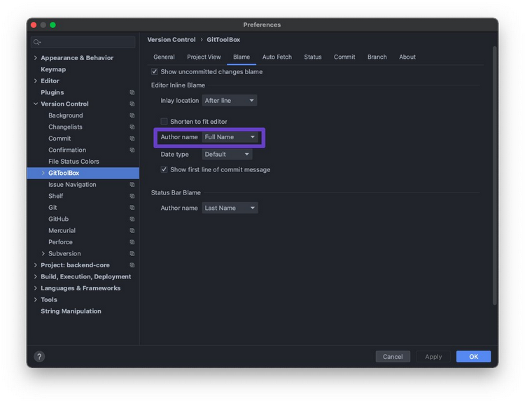

# PyCharm

## [Setup PyCharm to always have the `--keepdb` flag](faster-pycharm-tests.md)

## Docstring settings

## Git

Open a folder
- attach that folder
![[image-20230228154829471.png]]
### GitToolBox

inline git blame

## [Inline docs (PyCharm docs)](https://www.jetbrains.com/help/pycharm/inline-documentation.html)

`F1` and `Ctrl Space`

## Critical shortcuts

- Cmd + E
	- View recent files
- shift shift
	- Open files (like Cmd P in VSCode)
- option r
	- `manage.py` script
- shift-escape
	- hides the bottom toolbar in PyCharm!
	- useful when you always run black

## Connect to a remote server

1. Create a deployment config
2. Create an SSH config (click the 3 dots)
	1. ![[image-20230110152723507.png]]
		1. get the port from `formaai <ec2_instance_id> pf app`
	2. ![[image-20230110150635054.png]]
3. Create a Mapping
	1. syncs the container's `/app` folder with my `remote-container` folder
	2. ![[image-20230110150655880.png]]
4. Ensure it doesn't automatically sync files
	1. it's laggy
	2. ![[image-20230110153857402.png]]

5. Upload or Download from the container
	1. ![[image-20230110153209255.png]]

