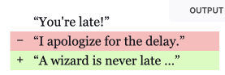

# HTML Tags

Browser doesn't recognize the tag?

-   Browsers inconsistent
-   May treat like div
-   Others will throw error????
-   Use a CSS normalizer

## [`ins`](https://developer.mozilla.org/en-US/docs/Web/HTML/Element/ins)

-   Inserted content
-   Think of GitHub diffs
-   
-   the default styling is pretty bare-bones 😞
-   if you want underlined text in markdown

```html
<del>
    <p>“I apologize for the delay.”</p>
</del>
<ins cite="../howtobeawizard.html" datetime="2018-05">
    <p>“A wizard is never late …”</p>
</ins>
```

<style>
  del,
  ins {
    display: block;
    text-decoration: none;
    position: relative;
  }

  del {
    background-color: #fbb;
  }

  ins {
    background-color: #d4fcbc;
  }

  del::before,
  ins::before {
    position: absolute;
    left: 0.5rem;
    font-family: monospace;
  }

  del::before {
    content: "−";
  }

  ins::before {
    content: "+";
  }
  :is(del, ins) p {
    margin: 0 1.8rem 0;
    font-family: Georgia, serif;
    font-size: 1rem;
  }
</style>
<div>
  <del>
    <p>“I apologize for the delay.”</p>
  </del>
  <ins cite="../howtobeawizard.html" datetime="2018-05">
    <p>“A wizard is never late …”</p>
  </ins>
</div>

## [`section` vs `article`](https://stackoverflow.com/a/24764861/8479344)

### Article

Examples

> -   **any independent item of content**
> -   **an interactive widget or gadget**
>     -   forum post
>     -   a magazine or newspaper article
>     -   a blog entry, a user-submitted comment
>     -   
>
> – <cite>https://html.spec.whatwg.org/multipage/sections.html#the-article-element</cite>

### Section

Examples

> -   chapters
> -   the various tabbed pages in a tabbed dialog box
> -   or the numbered sections of a thesis.
> -   web site's home page could be split into sections for
>     -   introduction
>     -   news items
>     -   contact information.
>
> – <cite>https://html.spec.whatwg.org/multipage/sections.html#the-section-element</cite>


## Modals

### Problem with `dialog`

- it's not accessible?

[Dialogs, modality and popovers seem similar. How are they different? | hidde.blog](https://hidde.blog/dialog-modal-popover-differences/)


## Form Elements

[[Forms]]