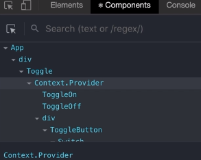
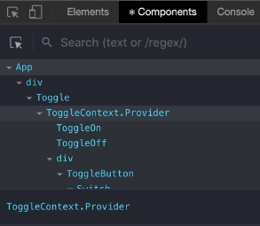

# [React Context](https://reactjs.org/docs/context.html)

## Why Context?

-   global state that anyone can access
    -   no prop drilling

### Example uses

data used by a ton of components

-   UI theme (dark/light mode)
-   authenticated user
-   Shopping cart
-   preferred language
-   [Flexible Compound Components](compound-components.md)

### What to reach for before using Context?

-   Try just passing down a React component instead of the props
-   https://reactjs.org/docs/context.html#before-you-use-context

### [Context vs Redux](./redux#redux-vs-react-context)

## Using Context

```jsx
// defaultValue used when there isn't a matching Context in the tree above
// defaultValue = undefined? it won't be used
const MyContext = React.createContext(defaultValue);
```

### [Context.displayName](https://reactjs.org/docs/context.html#contextdisplayname)

```jsx
MyContext.displayName = "MyContext";
```

used in React Dev Tools

#### Without `displayName`



#### With `displayName`



### Create a custom hook

let devs know that if you use this hook, it has to be in a provider

-   creating a `CountProvider` component wrapper
    -   so that it can have its own state and hooks to manage the state
    -   instead of directly using `<ToggleContext.Provider value={{count, setCount}}>...</...>`
-   you can pass `count` and `setCount` as the value of the Provider

#### `useCount` wrapper for better errors

```js
function useToggle() {
    const context = React.useContext(ToggleContext);
    if (!context) {
        throw new Error("useToggle must be within a ToggleContext");
    }
    return context;
}
```
