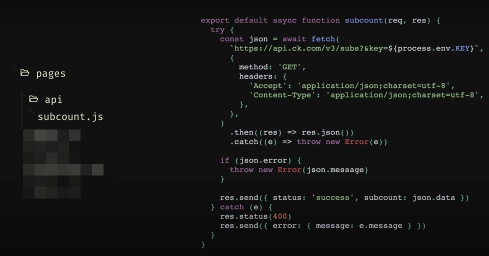

## SPA era
- 2014 -> 2020
- https://youtu.be/Wm_xI7KntDs?t=520
- React + React router 
- [[single-page-app]]
- Large bundle sizes & loading states

## Hooks
2019

- React shows how nice hooks are
- 3rd party hooks
	- Redux: useSelector
	- React Query is only possible with hooks
- Treat React like a UI primitive instead of an app platform
	- Next JS & Remix: use React for UI
	- don't use react for 
	- Nice features like SSG, SSR

## Server components? 
- 2023+
- [React's 3rd Wave](https://m.youtube.com/watch?v=oRGNpuLdlvQ)
- React is no longer a client side library
	- Server side framework that ships a client side bundle
- React shows nice server components
	- 3rd party implementations 
- Won't fully merge with Next
	- React is also used as the view on mobile, React Native, games, VR

## React Frameworks

-   Remix
-   Next.JS
-   Gatsby
-   Redwood JS

## Create React App

-   single page app
-   load JS at the beginning
    -   Gmail
-   bad SEO

## Gatsby

-   static site generator
-   don't need a server!
    -   there's a Gatsby service????

## Next JS

UI Dot Dev Video: https://fullchee-reminders.netlify.app/link/2056

-   add an `About.ts`
    -   creates an `/about` page
-   code splitting
-   image optimization `<Image />`
-   you can build API endpoints
    -   

### 3 ways Next JS renders a page

1. statically generate HTML at build-time 2. with the option of fetching data at build-time 3. `getStaticProps()`
2. Server render the page 3. calculate the HTML all on the backend
3. Fetch the data on the client 5. like a SPA

Incremental static regeneration

-   on a per page basis: regenerate a page on demand with new data

## Remix

-   https://fullchee-reminders.netlify.app/link/2055
-   created by the React Router team
-   only does static site rendering

    -   no static site generation
    -   no incremental static regeneration

-   like PHP or Ruby on Rails???

-   lots of pages & dynamic data with a database

## Redwood JS

Full stack JS framework

-   Syntax FM episode: https://fullchee-reminders.netlify.app/link/2057

