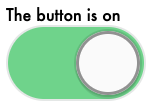
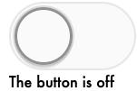

# [Compound components](https://kentcdodds.com/blog/compound-components-with-react-hooks)

[Epic React](https://epicreact.dev/modules/advanced-react-patterns/compound-components-intro)

## What

> set of components that share state
> create a simple, powerful declarative API

## Why Compound Components

1. Breaks things down 2. Makes things easier to change 3. need to make a change? it's clear which sub-element you should change
2. Flexible! 5. re-order the inside components

## Examples

-   like `Table` and `Column`
-   where `Column` expects a bunch of props from `Table` - but we don't set it
    Explicitly

A

```jsx
<Table>
    {/* `Table` gives `Column` some props behind the scenes */}
    <Column />
    <Column />
</Table>
```

A

```html
<select>
    <option>React</option>
</select>
```

## Epic React Toggle Example

Super flexible!

-   You can change the order of the children!
-   or straight up just remove any part

```jsx
<Toggle>
    <ToggleOn>The button is on</ToggleOn>
    <ToggleButton />
    <ToggleOff>The button is off</ToggleOff>
</Toggle>
```





### [`React.cloneElement()` API](https://reactjs.org/docs/react-api.html#cloneelement)

```javascript
React.cloneElement(element, [config], [...children]);
```

#### Why do we need `cloneElement()`?

-   like creating a new copy of array
-   parent (which has the state) can't modify props directly
    -   React doesn't let you modify the `child.props`

!!! note "Flexible Compound Components uses `React Context`"

    * passes props to any descendant
    * so we don't need `cloneElement`

### Passing in unexpected children

```jsx
<Toggle>
    <span>Hello!</span>
</Toggle>
```

Errors out

```
Invalid value for prop `toggle` on <span> tag.
```

#### Allowed List of components

```jsx
const ALLOWED_TYPES = [ToggleOn, ToggleOff, ToggleButton];

if (ALLOWED_TYPES.includes(child.type)) {
    return React.cloneElement(child, { on, toggle });
}
return child;
```

#### Blacklist/denylist: ignore HTML elements

more flexible

```javascript
typeof child.type === "string"; // HTML element
```

### Implementation

```jsx
return React.Children.map(children, (child, index) => {
    return React.cloneElement(child, {
        id: `i-am-child-${index}`,
        on,
        toggle,
    });
});

const ToggleOn = ({ on, children }) => on && children;

// Accepts `on` and `children` props and returns `children` if `on` is false
const ToggleOff = ({ on, children }) => !on && children;

// Accepts `on` and `toggle` props and returns the <Switch /> with those props.
const ToggleButton = ({ on, toggle }) => <Switch on={on} onClick={toggle} />;
```

## Passing in a React fragment

> If children is a Fragment it will be treated as a single child and not traversed.
>
> – <cite>https://reactjs.org/docs/react-api.html#reactchildren</cite>

```jsx
const childrenArr = React.Children.toArray(children);

const extraElements = childrenArr.filter(
    (el) => el.props.displayName === "extraElement"
);
const sectionChildren = childrenArr.filter(
    (el) => el.type.displayName === "Section"
);
```

## Flexible Compound Components

-   instead of passing props via `cloneElement`
-   we pass down data via `Context` and `useContext`

See [Compound Components](./react-context)
