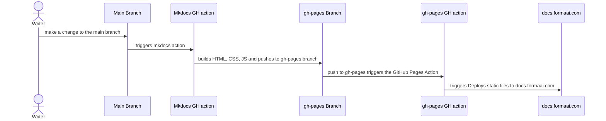

# [Fullchee's Notes](https://fullcheezhang.com/)

Instead of memorizing all things dev with [Anki flashcards](https://ankiweb.net), I am creating a second brain that I can reference.

## Local setup

1. Install `pipenv` globally
    1. `pip install --user pipenv`
2. Install the MKDocs dependencies
    1. In the `dev-docs` directory, run:
    2. `pipenv install`
3. Previewing as you write
    1. `pipenv run start`

## Setting up your writing environment

You can edit your markdown with your favorite text editor

I'd recommend a WYSIWYG Markdown editor

-   [Obsidian](https://obsidian.md/)
-   [Zettlr](https://www.zettlr.com/)

VSCode users

-   install the recommended extensions

PyCharm users

-   install the [Paste Images into Markdown](https://plugins.jetbrains.com/plugin/8446-paste-images-into-markdown) extension

### Vale (English linter) setup

Our CI/CD uses [vale CLI](https://docs.errata.ai/) to suggest changes to docs using the [Microsoft Style Guide](https://learn.microsoft.com/en-us/style-guide/welcome)

If you'd like to run the linter on your local computer as well, install vale CLI

-   Mac: `brew install vale`
-   Windows: `choco install vale`

## Tips on writing docs

### Tables

-   Paste a Bookstack table into [Zettlr](https://www.zettlr.com/) or in a GitHub comment
    -   it will generate the Markdown for the table

### Images

#### Pasting images

Make sure to upload images to the `./images` directory

-   Zettlr
    -   pasting an image from the clipboard will create an image file
-   VSCode
    -   use the [Paste Image extension](https://github.com/mushanshitiancai/vscode-paste-image) to paste images from the clipboard
-   PyCharm
    -   install the [Paste Images into Markdown](https://plugins.jetbrains.com/plugin/8446-paste-images-into-markdown) extension

#### Changing the image size

Markdown understands HTML. 🧠 You can use the `img` tag.

```html

```

##### MKDocs way of adding a height or width

[You can apply a height or width on the image](https://github.com/mkdocs/mkdocs/issues/1678#issuecomment-455500757)

```markdown
{: style="height:150px;width:150px"}
```

This will be resized in MKDocs but not in GitHub during code review.

### Unable to open MKDocs?

If you get an error like

`Access to 127.0.0.1 was denied`

Then try opening that URL in another browser.

## Why mkdocs-material

### Markdown

-   portable
-   extendable

### Features

-   [Search 🔎](https://squidfunk.github.io/mkdocs-material/setup/setting-up-site-search)
-   [Google Analytics 👀](https://squidfunk.github.io/mkdocs-material/setup/setting-up-site-analytics)
    -   which pages have the most/least views?
-   Diagrams
    -   [Mermaid.js Diagrams 🎨](https://mermaid-js.github.io/mermaid/#/?id=diagram-types)
    -   We can import more libraries like [Diagrams](https://diagrams.mingrammer.com/)
-   [Emojis](https://squidfunk.github.io/mkdocs-material/reference/icons-emojis/)

### Git

-   code review 👀
    -   more people will know about docs, peer reviewed, higher quality docs
-   every line has a "last updated date"
-   GitHub actions

### Python

-   inclusive: most devs at Forma use Python

### Where to learn more about MKDocs

-   [mkdocs.org](https://www.mkdocs.org)
-   [MKDocs Material Theme](https://squidfunk.github.io/mkdocs-material/getting-started/)

## Project layout

    mkdocs.yml    # The configuration file.
    docs/
        index.md  # The documentation homepage.
        ...       # Other markdown pages, images and other files.

## How MKDocs works


